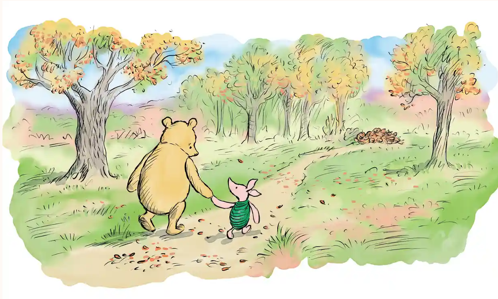

class: title-slide, middle

<style type="text/css">
  .title-slide {
    background-image: url('assets/img/bg.jpg');
    background-color: #23373B;
    background-size: contain;
    border: 0px;
    background-position: 600px 0;
    line-height: 1;
  }
</style>

# Model evaluation with ecological data

<hr width="65%" align="left" size="0.3" color="orange"></hr>

## Bayesian approaches

<hr width="65%" align="left" size="0.3" color="orange" style="margin-bottom:40px;" alt="@Martin Sanchez"></hr>

.instructors[
  **ECL707/807** - Dominique Gravel
]

</img>

---
# Bayesian Philosophy

What makes a Bayesian way of thinking? 

--

$$
P(A|B) = \frac{P(B|A)P(A)}{P(B)}
$$

is it Bayes Rule?


--

Not entirely! On it's own, this Rule is just logic/algebra

---
# Bayesian Philosophy

Bayesians quantify uncertainty with probability 

```{r echo=FALSE, message=FALSE, warning=FALSE}
suppressPackageStartupMessages(library(tidyverse))

betacurve <- function(x, phi) dbeta(x, .4*phi, (1-.4)*phi)

tibble(x = seq(from = 0.01, to = 0.99, length.out = 100),
       y1 = betacurve(x, 4),
       y2 = betacurve(x, 10),
       y3 = betacurve(x, 20)) %>% 
  pivot_longer(-x) %>% 
  ggplot(aes(x = x, y = value, colour = name)) +
  guides(color = FALSE) + 
  geom_line(lwd = 3) + 
  theme_bw()+
  scale_color_brewer(type = "qual") + 
  labs(x = "Probability of Survival",
       y = "Density")
```

---
# Bayesian Philosophy

In other words: Bayesians consider that the scientific world is divided into two parts: 

* .huge[**The Observed**]: Data! the observations, numbers, photos, "y variables" whatever you call them

--

* .huge[**The Unobserved**]: parameters, latent states, usually of much more general scientific interest


---
class: center
# Bayesian Philosophy

How do we use the observed to learn about the unobserved? 

We use: 


$$
[y, \theta]
$$

the **joint distribution of the parameters and the data**

---

uh what kind of joint is this

.pull-left[]


.pull-right[]

---
# Bayesian Philosophy
.pull-left[A simple sketch of a joint distribution: when a parameter changes (survivorship probability) the observations also change. Likewise, we might think that a change in the observations suggests that the unseen probability has also changed.]

.pull-right[
```{r echo = FALSE}
tibble(p = rep(c(.2, .6, .9), each = 10),
       survived = rbinom(30, 10, prob = p)) %>% 
  ggplot(aes(x = p, y = survived)) + geom_point(position = position_jitter(width = .05), size = 3) + 
  theme_bw() + 
  labs(x = "Probability of survivorship", y = "Survival")
  
```
]

---
# Bayesian Philosophy

We _factor_ the joint distribution into two parts, like this: 

$$
[y, \theta] = [y | \theta]\times [\theta]
$$

--

* $[y|\theta]$ is the Likelihood

--

* $[\theta]$ is the prior

--

And finally apply Bayes Rule

$$
[\theta|y] = \frac{[y|\theta][\theta]}{[y]}
$$

This numerator involves summing up the likelihood over **all possible prior values**. In other words, considering what DID happen relative to everything that _could have_ happened!

---
# Goal for today

Today we will build intuition for Bayesian inference. By the end of today (or tomorrow!) you will have learned how to find, and work with, the posterior distributions of parameters

We'll look at the following topics

* Posterior via grid search

--

* Posterior via conjugate priors

--

* Metropolis and Metropolis-Hastings algorithms

--

_brief detour into Hierarchical Models!_

--

* Gibbs sampling

---
class: centre

# Grid Search

*Objective* intuition for how we actually multiply the prior by the likelihood to get a probability density function. 

Grid search is very similar to our initial Maximum Likelihood procedures, with the addition of a prior

---
# Chick survival

The Fake Petrel ( _Hydrobates inventus_ ) lays precisely 6 eggs. You have data on survivorship from 10 different nests:

```{r echo = TRUE}
set.seed(1859)
x_obs <- rbinom(10, 6, 0.6)
x_obs
```

Our model is:

$$
\text{hatched}_{i} \sim \text{Binomial}(\theta, 6)
$$
Because we want the Bayesian posterior distribution, we also need a prior for $\theta$

$$
\theta \sim \text{Uniform}(0,1)
$$

We'll try several, but this is our starting point
---

Use grid search to find the posterior distribution of $\theta$, the probability that an egg successfully hatches. 

# Steps
1. make a vector of probabilities for $\theta$ using `seq(from = 0, to = 1, length.out = n)`
1. Think about the prior you might use. Start with `dunif(x, min = 0, max = 1)`.
1. find the probability of each of these values of $\theta$ via `dunif`
1. find the likelihood for each of these values of $\theta$ via `dbinom`
1. multiply these two columns together
1. normalize (divide by the sum)

---
# Notes and reminders

A note on the Beta distribution: 

$$
\text{Beta}(\alpha = \mu\phi, \beta = (1 - \mu)\phi)
$$

* $\mu$ the average probability
* $\phi$ the "concentration" around this value

---
class: center
# conjugate priors

---

# Conjugate priors 

Conjugate priors exist for many common probability distributions

The posterior is the same distribution as the prior with new, updated parameters

--

> it is embarassing to do an elaborate numerical procedure to obtain results that can be obtained on a napkin -- Hobbs and Hooten

--


---

$$[\theta] = {\theta^{\alpha-1}(1-\theta)^{\beta-1} \over \text{Beta}(\alpha,\beta)}$$
$$[y|\theta] = {n \choose y}\theta^y(1-\theta)^{n-y}$$

$$
[y|\theta][\theta] \propto \theta^{\alpha-1}(1-\theta)^{\beta-1} \times \theta^y(1-\theta)^{n-y}
$$

$$
[y|\theta][\theta] \propto  \theta^{y + \alpha-1}(1-\theta)^{n - y + \beta-1}
$$

$$
[\theta|y] = \frac{\theta^{y + \alpha-1}(1-\theta)^{n - y + \beta-1}}{ \text{Beta}(\alpha + y,\beta + n-y)}
$$
---
# Conjugate priors

| prior      | likelihood | Posterior                                                                                                     |
|-------------------|-----------------------|------------------------------------------------------------------|
| $p ~\sim \text{Beta}(\alpha,\beta)$           | $y \sim \text{Binomial(p, N)}$           | $p \sim \text{Beta}(\alpha + \sum y, \beta + \sum (n- y)$                   |
| $\lambda \sim \text{gamma}(\alpha, \beta)$          | $y \sim \text{Poisson}(\lambda)$  |  $\lambda \sim \text{gamma}(\alpha + \sum y, \beta + n)$       |

---
# Petrels again

Lets go back to our Fake Petrel data

```{r echo = TRUE}
set.seed(1859)
x_obs <- rbinom(10, 6, 0.6)
x_obs
```

Calculate the conjugate posterior and add it to the figure using `curve`. How does it compare to grid search.

---
# Predictions

In both of these approaches, we end up with a _distribution_ for p. How can we use this to make predictions? 

* sample values from your posterior for $p$
* for each sampled value, sample a single surviving nest of 6 eggs
* do this lots of times 

_remember R is vectorized_ 

--

e.g. for prior $\mu = 0.3$ and $\phi = 5$

```{r }
ps <- rbeta(200, 0.3 * 5 + sum(x_obs),
            0.7 * 5 + sum(6 - x_obs))
ys <- rbinom(200, size = 6, prob = ps)

```

---
# Exercise with your data

does the Distribution you chose have a conjugate prior? Can you estimate the posterior distribution this way? 

---
class: inverse, centre

# Markov Chain Monte Carlo

---
# Remember Simulated Annealing

Your grasp of simulated annealing will extend to understanding MCMC methods as well! 

Three things to keep in mind: 

* We can work with a function even if it is too complex to analyze directly

--

* the *Effeciency* of an algorithm is key, especially when problems grow

--

* We get several knobs to turn to control how an algorithm behaves. Another thing to think about as you perform modelling! 

---

# MCMC "magic"

The objective of MCMC algorithm is to simulate parameters from a complex posterior distribution.

--

Rather than measure the *absolute* probability of different parameter values:

$$
[\theta|y] = \frac{[y|\theta][\theta]}{[y]}
$$

we sample, and evaluate the *relative* probability of two possible parameter values:

$$
\frac{[\theta^{new}|y]}{[\theta^k|y]} = \frac{[y|\theta^{new}][\theta^{new}]}{[y|\theta^k][\theta^k]}
$$

In this way, we can sample a probability distribution ( $[\theta|y]$ ) using only something _proportional_ to that distribution ( $[y|\theta][\theta]$ ) 

---
# The Metropolis Algorithm

* Draw $\theta^{new}$ from a _symmetric_ distribution centered on $\theta^{k}$ (i.e. in the $k$th interation, the current value)
e.g. $\theta^{new} \sim N(\theta^{k}, \sigma_{tune})$
* Calculate the ratio R:

$$
R = \text{min}\left( 1, \frac{[y|\theta^{new}][\theta^{new}]}{[y|\theta^k][\theta^k]}\right)
$$

This is the probability of acceptance. In other words, if the ratio is better always take it. If the ratio is less than 1, there's a chance we'll take it anyway.

* Test to see if `runif(1, min=0, max=1)` $< R$. if so, set $\theta^{k + 1} = \theta^{new}$

* **Discussion question**: why should we accept "worse" parameter values? Why is it good to sometimes stay in the same place? 

---
class: center 
# Visualizing

```{r echo = FALSE, fig.retina=3}
suppressPackageStartupMessages(library(tidyverse))
tibble(x = seq(0, 10, length.out = 200),
       y = dnorm(x, mean = 5, sd = 2)) %>% 
  ggplot(aes(x, y)) + geom_line() + 
  theme_bw() + 
  theme(axis.text = element_blank())+
  geom_vline(xintercept = 5, lty = 2) + 
  labs(y = NULL, x = "Old value") +
  annotate("segment", x = 5.1, xend = 7, y = .1, yend = .1, arrow = arrow()) + 
  annotate("segment", x = 4.9, xend = 3, y = .1, yend = .1, arrow = arrow()) + 
  annotate("text", x = 6, y = .11, label = "sigma[tune]", parse = TRUE)
```

---
class: center 

# Visualizing

```{r echo = FALSE, fig.retina=3}
tibble(x = seq(0, 10, length.out = 200),
       y = dnorm(x, mean = 5, sd = 2)) %>% 
  ggplot(aes(x, y)) + geom_line() + 
  theme_bw() + 
  theme(axis.text = element_blank())+
  geom_vline(xintercept = 5, lty = 2) + 
  labs(y = NULL, x = "Old value") +
  geom_vline(xintercept = 6.7, lty = 2) + 
  annotate("text", y = 0.01, x = 7.5, label = "new value??")
```

---
# quick reminder! 

--

* the candidate distribution is not the prior

--

* the candidate distribution is not the prior

--

* the candidate distribution makes new values but it's not the prior, you still have to put the values it produces into the likelihood and the prior

---
# Now: to math! 

$$
r = \frac{\text{Likelihood}(\text{data}|\theta^{new}) \times \text{Prior}(\theta^{new}, \alpha, \beta)}{\text{Likelihood}(\text{data}|\theta^{old}) \times \text{Prior}(\theta^{old}, \alpha, \beta)}
$$

* here I'm using $\alpha$ and $\beta$ to mean any prior parameters. They don't change!

* plug the new candidate value into the likelihood and multiply by the prior

---
# Try it out!

Use the Metropolis algorithm to fit the following data on the Fictitious Leafhopper abundance on 5 plants:

```{r echo=TRUE}
set.seed(1859)
xs <- rpois(5, 27)
xs
```

$$
\begin{align}
y &\sim \text{Poisson}(e^{\alpha}) \\
\alpha &\sim \text{Normal}(10, 2)
\end{align}
$$

_suggestion_ use as a candidate distribution $\text{Normal}(\theta^k, \sigma_{tune})$

This means making your guesses with `rnorm(1, mean = old_param, sd = tune)`

**Compare your result to the conjugate posterior! you should get very similar shapes**

---
# Metropolis Hastings

Sometimes you need an _asymmetrical_ distribution for your parameter. This happens when the parameter is bounded. 

In this case, we need to adjust our calculation of $r$. Now in addition to the Likelihood and Prior, we have the Candidate distribution getting involved

$$
\frac{[y|\theta^{new}][\theta^{new}][\theta^{old}|\theta^{new}]}
{[y|\theta^{old}][\theta^{old}][\theta^{old}|\theta^{new}]}
$$ 

.small[
<p>
$$
r = \frac{\text{Likelihood}(\text{data}|\theta^{new}) \times \text{Prior}(\theta^{new}, \alpha, \beta) \times \text{Candidate}(\theta^{old}, \mu = \theta^{new}, \sigma_{tune})}{\text{Likelihood}(\text{data}|\theta^{old}) \times \text{Prior}(\theta^{old}, \alpha, \beta)\times \text{Candidate}(\theta^{new}, \mu = \theta^{old}, \sigma_{tune})}
$$
</p>
]

then finally 
$$
R = \text{min}( 1, r)
$$

---
# Try it out!

Use the Metropolis-Hastings algorithm to fit the following data on the Fictitious Leafhopper abundance on 5 plants:

```{r echo=TRUE}
set.seed(1859)
xs <- rpois(5, 27)
xs
```

$$
\begin{align}
y &\sim \text{Poisson}(e^{\alpha}) \\
\alpha &\sim \text{Normal}(10, 2)
\end{align}
$$

_suggestion_ use as a candidate distribution $\text{LogNormal}(log(\theta^k), \sigma_{tune})$

This means making your guesses with `rlnorm(1, mean = log(old_param), sd = tune)`

**Compare your result to the conjugate posterior! you should get very similar shapes**

---
